# LAB 01

Lab is part of [Docker Essentials: A Developer Introduction](https://courses.cognitiveclass.ai/courses/course-v1:IBMDeveloperSkillsNetwork+CO0101EN+v1/course/)

## Before the lab
Although originally lab starts with *docker run* command I thought it wold be nice to be able to first download image without running it. 
Thus *docker pull* command becomes handy. To download Ubuntu 18.04 docker official image form  hub.docker.com it is enough to run
> docker pull ubuntu:bionic

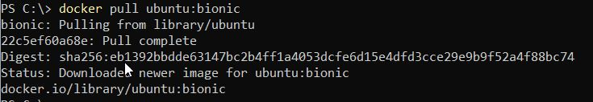

I run docker desktop, so newly downloaded image will appear in my image list
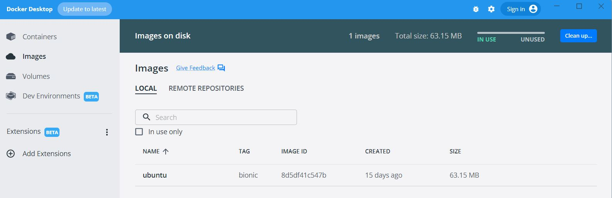

Pulling docker image is easy - delete required set of command. First it is necessary to know image ID:
> docker image list

Now when image ID is known it is possible to remove image
> docker image rm 8d5df41c547b

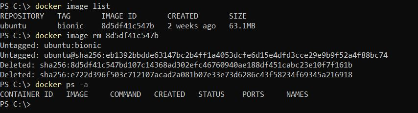

## Run container
Let's get back to running container. No matter if the image was previously pulled or not, following command
```
docker run -it ubuntu:bionic top
```
will start Ubuntu container and top program inside this container. Parameter -i (interactive) allow me to effectively stop the container by simple ctrl-c. Thanks to -t I can see top is running (to be honest - without that container will instantly stop running)

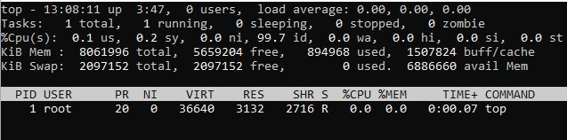


While container is running - lets try to ssh into it. 

But first it is necessary to find ID of a container. This can be done with:
```
docker container ls
```

Container ID is one of the field in command output. Now I can invoke bash inside the container
```
docker container exec -it 033098b1a5b2 bash
```
and check what processes are running there
```
ps -ef
```

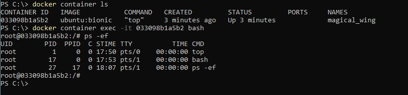


## Run multiple containers

Next step is to run container from [official nginx](https://hub.docker.com/_/nginx) image

```
docker container run --detach --publish 8080:80 --name nginx nginx
```
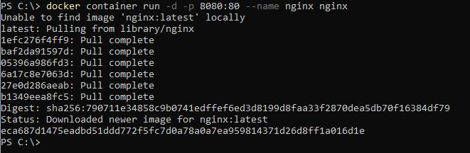

As expected - nginx is accessible on port 8080 of the local host
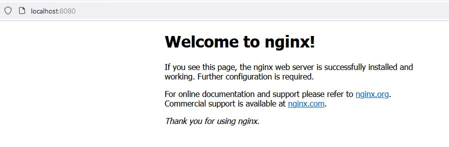

Now - another container. This time I will use official [MongDB](https://hub.docker.com/_/mongo) image. This time there is a lot of tags to [choose from](https://hub.docker.com/_/mongo/tags)
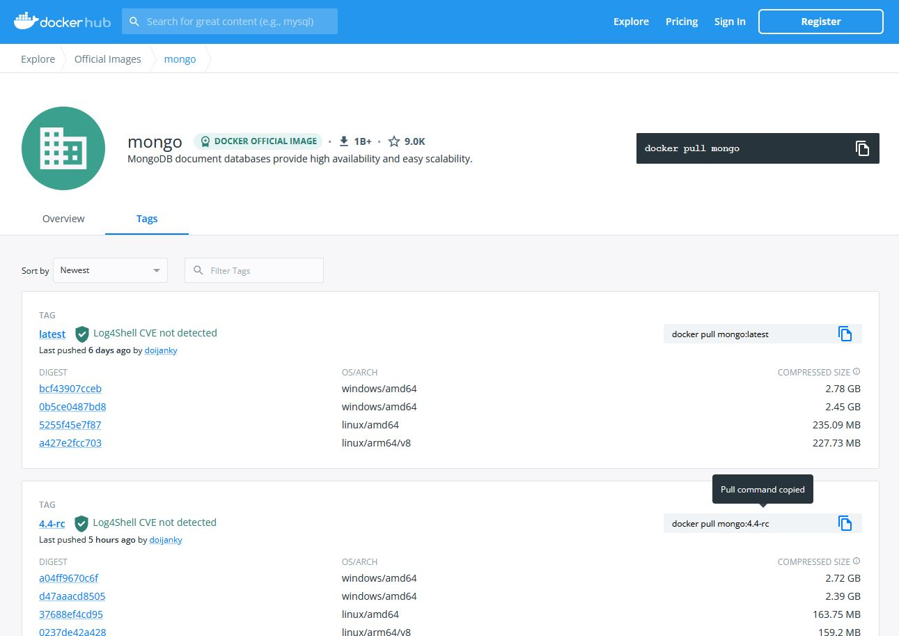

To run container I run following command
```
docker container run --detach --publish 8081:27017 --name mongo docker pull mongo:4.4-rc
```
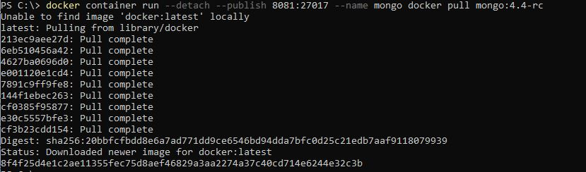

When I list containers - both of them (nginx and MongoDB) ara running

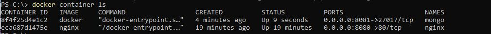

# Remove the container

Now it's time to end this lab and stop containers.

Following lab manual I have to first know the container IDs (with ***docker container ls***) and then use these IDs to stop containers. Of course this woks:
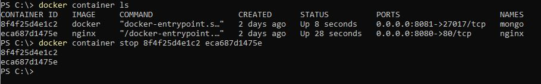

But am I able to do the same with containers names (after all there should be a reason why I named them) ? 
Of course - to prove it I restarted containers and stopped them "by name"

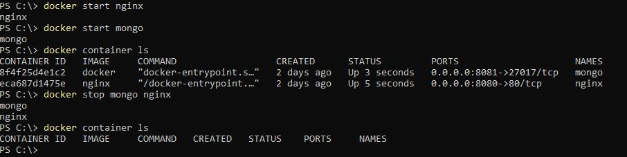

Well - this is not the end. Containers are stopped, but still exists  (which can be verified with ***docker container ls -a***). To remove it completely I run
```
docker system prune
```

This is the result:
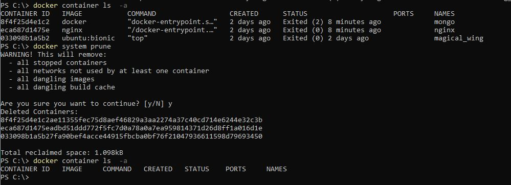


This is the end of Lab 01
