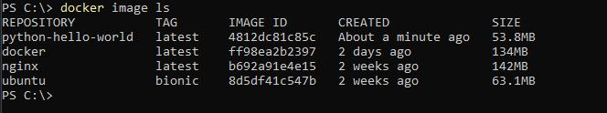
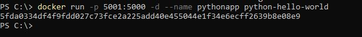
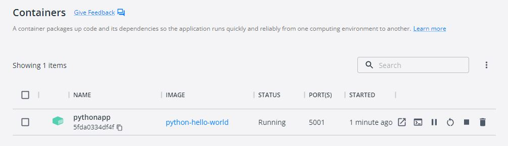
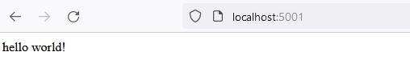
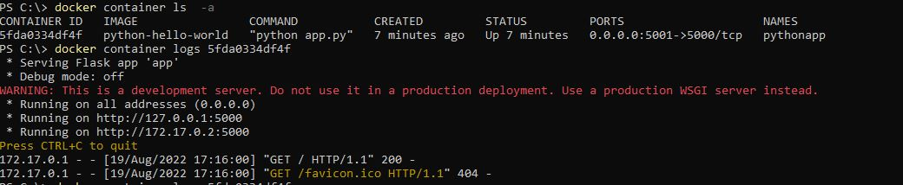
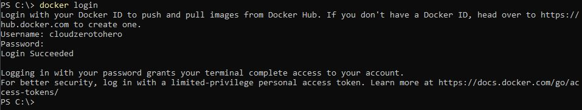
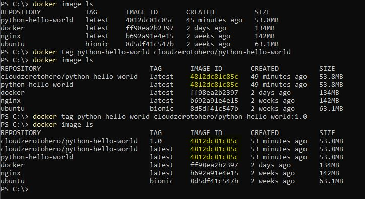
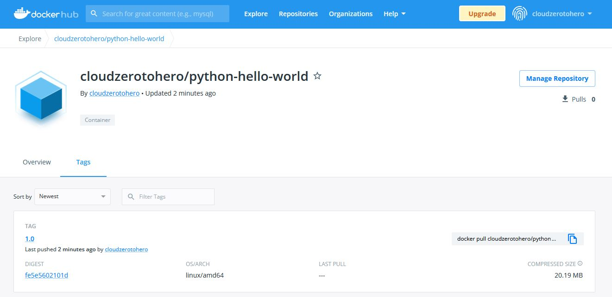
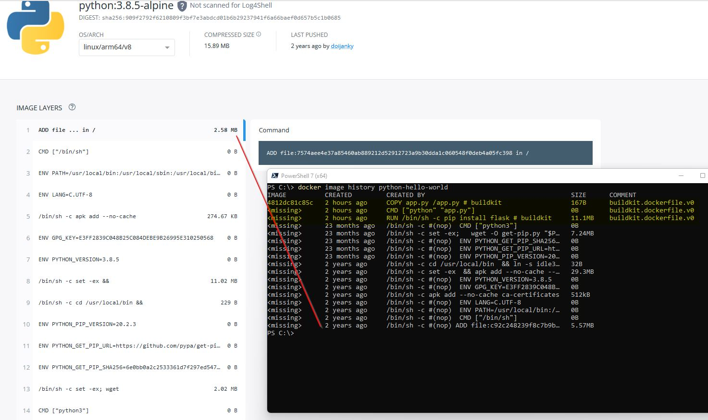

# LAB 02


## Create a Python app (without using Docker)

First step is to create a Python file with simple app. How complicated it can be ? :wink:

File looks like this:
``` py
from flask import Flask

app = Flask(__name__)

@app.route("/")
def hello():
    return "hello world!"

if __name__ == "__main__":
    app.run(host="0.0.0.0")
```


BTW - source files are available here:
> https://github.com/cloudZeroToHero/DevOpsCamp-Docker/tree/main/Code/Lab02

## Dockerfile

A dockerfile lists the instructions necessary to build a Docker image. As a base layer I will use python:3.8.5-alpine image. According to Lab manual "The alpine version means that it uses the alpine distribution, which is significantly smaller than an alternative flavor of Linux. A smaller image means it will download (deploy) much faster, and it is also more secure because it has a smaller attack surface."

On top of that is **RUN** command that executes commands - in this case install package
Next is the **CMD** command that describes what will run once container starts.
Last but not least - **COPY** command which in this case copies file from the same directory where dockerfile is into a new layer.

All and all - file looks like this:

``` dockerfile
FROM python:3.8.5-alpine
RUN pip install flask
CMD ["python","app.py"]
COPY app.py /app.py
```

## Build the Docker image

After all those preparations is time to crate an image.
```
docker image build -t python-hello-world .
```
(don't forget . a the end fo command above)

Few moments later I can enjoy new image



## Run the Docker image

Let's run the container
```
docker run -p 5001:5000 -d --name pythonapp python-hello-world 
```



This is how it looks on Docker desktop



And if I open web browser to see what is on localhost port 5001 I can see that app is running



## Output log

With 
```
docker container logs <container_id>
```
I can check what was sent to standard output by the application:




## Push image to Docker hub

First step - crate a account on [Docker hub](https://hub.docker.com/). Fortunately there is possibility to crate a free account :smile:


To login to Docker hub use 
```
docker login
```


Now the fun part - I have to add tag to the image to "tag it" as the one which should be stored in Docker Hub.

The command from Lab manual is 
```
docker tag python-hello-world [dockerhub username]/python-hello-world
```
Works fine (now I have two images with the same ID but with different tags), but it also shows one flaw - all the images are tagged as "latest". So - a bit too late I decided to add another tag - this time with version tag.
```
docker tag python-hello-world cloudzerotohero/python-hello-world:1.0
```



Command to push the image to Docker Hub:
```
docker push cloudzerotohero/python-hello-world:1.0
```

What a success - image is now on the hub with proper version tag


## Deploy a change

Time to see how to deploy changes. 
First step - change app source file. Now it looks like this:

``` py
from flask import Flask

app = Flask(__name__)

@app.route("/")
def hello():
    return "Hello Beautiful World!"

if __name__ == "__main__":
    app.run(host="0.0.0.0")
```


Rebuild the app
```
docker image build -t cloudzerotohero/python-hello-world:1.0 .
```
Push it to Docker Hub
```
docker push cloudzerotohero/python-hello-world:1.0
```

And brand new image is uploaded to Docker hub :smile:

## Image layers

It is possible to check what layers constitute the image. 
To list it simply run
```
 docker image history python-hello-world
```

As it was expected layers listed in command output correspond to what can be found on official Python3 image plus what was the content of the Dockerfile




## Cleanup

Now it is time to cleanup environment
Check if eny container is running with 
```
docker container ls
```
If so - stop it with 
```
docker container stop <container-id>
```
And remove containers with 
```
docker system prune
```


