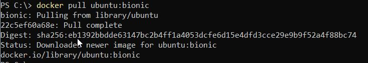
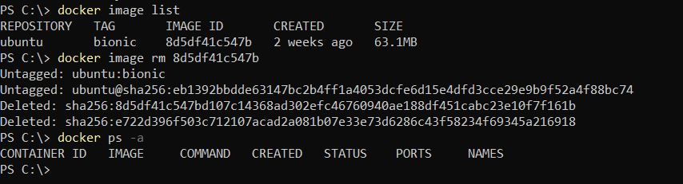
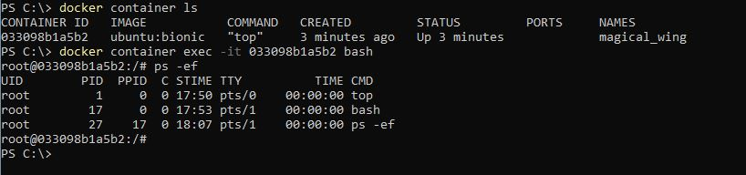

# LAB 01

Although originally lab starts with *docker run* command I thought it wold be nice to be able to first download image without running it. 
Thus *docker pull* command becomes handy. To download Ubuntu 18.04 docker official image form  hub.docker.com it is enough to run
> docker pull ubuntu:bionic



I run docker desktop, so newly downloaded image will appear in my image list


Pulling docker image is easy - delete required set of command. First it is necessary to know image ID:
> docker image list

Now when image ID is known it is possible to remove image
> docker image rm 8d5df41c547b



Let's get back to running container. No matter if the image was previously pulled or not, following command
```
docker run -it ubuntu:bionic top
```
will start Ubuntu container and top program inside this container

Then it will be possible to ssh into this container. But first it is necessary to find ID of a container. This can be done with:
```
docker container ls
```

Container ID is one of the field in command output. Now I can invoke bash inside the container
```
docker container exec -it 033098b1a5b2 bash
```
and check what processes are running there
```
ps -ef
```




